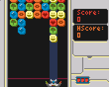

# Raquer * Mete

It's a clone of the minigame [Hack*Match](https://www.youtube.com/watch?v=socMP6jpA_A) in the excellent [Exapunks](http://www.zachtronics.com/exapunks/), made for the [Pokitto](https://www.pokitto.com/).

It's a rather faithful clone, including freezing time, combos, bombs, and same number of lines and columns. The most notable missing feature is the speed not increasing over time in this version.

The game does not have sound, at least yet. I may add sfx later on. I may also fine-tune freenzing time, bomb rate, falling speed, the **color palette**, etc.

You can find a video of the game running on the [emulator](https://github.com/felipemanga/PokittoEmu) with this [link](https://youtu.be/QAOuVoEG2bc) and on the **actual Pokitto** [here](https://youtu.be/mi8BovujRD0).

Disclaimer about the name: it's a joke that only makes sense in Portuguese.

**Have fun!**

## Note
First, I coded this game exclusively for fun.

This code is a *complete* **mess** and sure isn't a good depiction of the usual quality of my code.
I'll admit that I have almost null experience with embedding programming. I started it simple, then one bad practice led to another, and at the end of the day, I was writing important literals like the number of rows and columns inline so that changing even this minor aspect now is a headache :)

I'd rather not comment about the current impossibility of writing unit tests for this.

I'm sorry for that. It was nonetheless a fun day coding it, the game **works** on the Pokitto (and on the [emulator](https://github.com/felipemanga/PokittoEmu) as well) and I finally can play it anywhere. 
